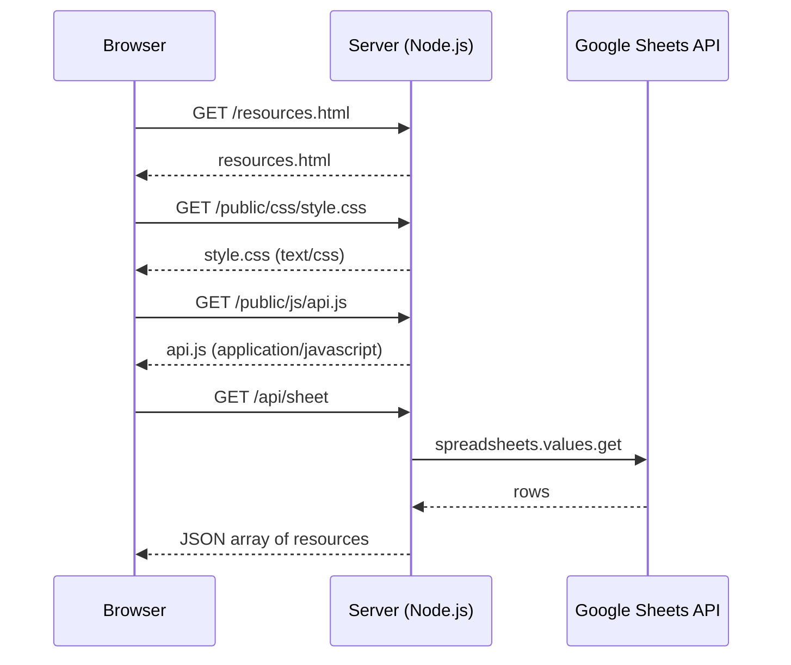
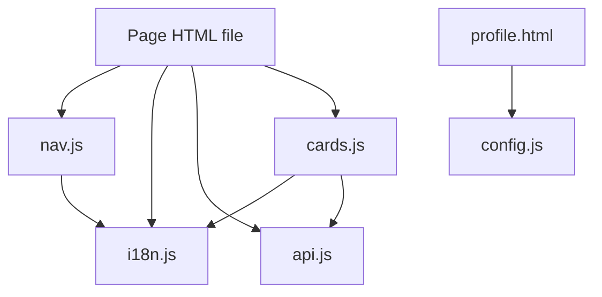
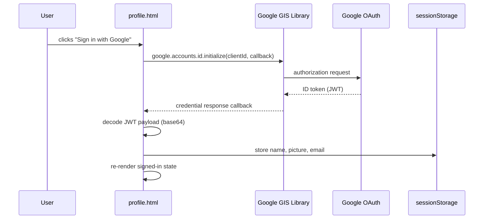

# Design Document: Resource Hub

## Overview

The CFES Toolbox Resource Hub is a bilingual (EN/FR) multi-page static web application served by the existing bare Node.js HTTP server. It surfaces curated resources from a Google Sheet, organized by category, with search, filter, save, and profile features.

The frontend is plain HTML/CSS/JS — no framework — spread across six pages. All pages share a common CSS/JS asset layer under `/public/`. The backend requires only a small update to serve `.css` and `.js` files with correct MIME types.

### Key Design Principles

- **No framework, no bundler.** Each page is a standalone HTML file. Shared behaviour is delivered via ES-module-style CommonJS-compatible plain JS files in `/public/js/`.
- **Progressive enhancement.** Core page structure is in HTML; JS enhances with dynamic data and interactivity.
- **Single API source of truth.** All data flows from `GET /api/sheet` (with optional query params). Client-side code caches the last fetch per page load.
- **Minimal server changes.** Only MIME types and a static config file for the Google client ID are needed server-side.

---

## Architecture

### File / Folder Structure

```
project root/
├── server.js                   ← update MIME map
├── routes/
│   └── sheet.js                ← unchanged
├── public/                     ← new shared assets
│   ├── css/
│   │   └── style.css           ← global design system (variables, reset, nav, card)
│   ├── js/
│   │   ├── translations.js     ← single source of truth for all UI text (EN + FR)
│   │   ├── i18n.js             ← language toggle + localStorage persistence
│   │   ├── api.js              ← fetch wrapper for /api/sheet
│   │   ├── cards.js            ← Resource Card renderer + save logic
│   │   ├── nav.js              ← hamburger menu open/close
│   │   └── config.js           ← static config (Google client ID)
├── index.html                  ← Landing Page
├── resources.html              ← All Resources Page
├── category.html               ← Category Page
├── saved.html                  ← Saved Resources Page
├── profile.html                ← User Profile Page
├── about.html                  ← About Page
└── credentials.json            ← (existing, server-side only)
```

### Request / Response Flow



### Component Dependency Diagram



---

## Components and Interfaces

### 1. Server — `server.js` (updated)

The MIME map is extended to serve CSS and JS with correct Content-Type headers.

```js
const mime = {
  '.html': 'text/html',
  '.ttf':  'font/ttf',
  '.css':  'text/css',
  '.js':   'application/javascript',
};
```

No other server changes are required. All HTML, CSS, and JS files are served as static files.

### 2. `public/js/translations.js` — Translation Dictionary

Single source of truth for every UI string in the application. All strings are keyed by dot-namespaced IDs and contain both language variants.

```js
const TRANSLATIONS = {
  'nav.home':        { en: 'Home',         fr: 'Accueil' },
  'error.load':      { en: 'Failed to load resources.', fr: 'Impossible de charger les ressources.' },
  // ... all other strings
};
```

To add or edit a translation, change `translations.js` only.

### 3. `public/js/i18n.js` — Language Toggle Module

Manages the Active Language and re-renders all `data-i18n` elements on the page using `TRANSLATIONS`.

**Public API:**

```js
// Returns the current language: 'en' | 'fr'
function getLang()

// Sets the active language, persists to localStorage, re-renders all [data-i18n] nodes,
// and updates the <html lang> attribute.
function setLang(lang)

// Initialises language from localStorage (default: 'en').
// Should be called once per page on DOMContentLoaded.
function initLang()

// Returns the active-language string for a given translation key.
function getString(key)
```

**How it works:**
- Every piece of translatable text in HTML carries a single `data-i18n="key"` attribute.
- `setLang` iterates all `[data-i18n]` elements, looks up the key in `TRANSLATIONS`, and sets `textContent` (or `placeholder` for inputs).
- `localStorage` key: `cfes-lang`
- `translations.js` must be loaded before `i18n.js`.

### 3. `public/js/api.js` — API Client Module

Thin wrapper around `fetch` for the `/api/sheet` endpoint.

**Public API:**

```js
// Fetches all resources, optionally filtered.
// params: { id?, category?, free? }
// Returns: Promise<Resource[]>
async function fetchResources(params = {})
```

- Builds a `URLSearchParams` string from non-null `params` values.
- Throws on non-2xx responses.

### 4. `public/js/cards.js` — Resource Card Renderer

Renders Resource Cards and handles the save/unsave action.

**Public API:**

```js
// Renders a <article class="resource-card"> element for a resource.
// lang: 'en' | 'fr'
// Returns: HTMLElement
function renderCard(resource, lang)

// Returns the Set<number> of saved resource IDs from localStorage.
function getSavedIds()

// Adds an id to cfes-saved in localStorage.
function saveResource(id)

// Removes an id from cfes-saved in localStorage.
function unsaveResource(id)

// Toggles save state and updates the card's bookmark icon.
// Called from the card's button click handler.
function toggleSave(id, buttonEl)
```

**Resource Card HTML structure:**
```html
<article class="resource-card" data-id="42">
  <div class="card-header">
    <h3 class="card-title">...</h3>
    <button class="btn-save" aria-label="Save resource" data-saved="false">
      <!-- bookmark SVG icon -->
    </button>
  </div>
  <p class="card-desc">...</p>
  <div class="card-meta">
    <span class="badge badge-category">...</span>
    <!-- one badge per category -->
    <span class="badge badge-free">Free</span>  <!-- or badge-paid -->
  </div>
</article>
```

### 5. `public/js/nav.js` — Navigation Menu Module

Manages the hamburger menu open/close behaviour.

**Public API:**

```js
// Attaches event listeners to hamburger button and overlay.
// Should be called once on DOMContentLoaded.
function initNav()
```

**Nav HTML structure (shared across all pages):**
```html
<header class="site-header">
  <a class="logo" href="/">Toolbox</a>
  <div class="header-controls">
    <button class="lang-toggle" aria-label="Switch language">EN / FR</button>
    <button class="hamburger" aria-label="Open menu" aria-expanded="false">&#9776;</button>
  </div>
</header>
<nav class="nav-menu" aria-hidden="true">
  <button class="nav-close" aria-label="Close menu">&times;</button>
  <ul>
    <li><a href="/">Home</a></li>
    <li><a href="/resources.html">Resources</a></li>
    <li><a href="/saved.html">Saved</a></li>
    <li><a href="/profile.html">Profile</a></li>
    <li><a href="/about.html">About</a></li>
  </ul>
</nav>
<div class="nav-overlay" aria-hidden="true"></div>
```

### 6. `public/js/config.js` — Static Client Config

Holds the Google OAuth client ID. Committed without the client secret.

```js
// public/js/config.js
const CONFIG = {
  googleClientId: 'YOUR_CLIENT_ID.apps.googleusercontent.com',
};
```

This file is the only place the client ID appears. It is not a secret.

### 7. Per-Page JS (inline `<script>` in each HTML file)

Each HTML page includes a small inline `<script>` (or a page-specific `<script src="...">`) that:
1. Calls `initLang()` and `initNav()` on `DOMContentLoaded`.
2. Fetches data from `api.js` and renders cards with `cards.js`.
3. Wires up page-specific interactions (search bar, filter panel, etc.).

---

## Data Models

### Resource (from API)

```js
/**
 * @typedef {Object} Resource
 * @property {number|null} id
 * @property {string} title-en
 * @property {string} titre-fr
 * @property {string} link-en
 * @property {string} lien-fr
 * @property {string} description-en
 * @property {string} description-fr
 * @property {string} categories   — comma-separated, e.g. "Finance,Career"
 * @property {boolean} free
 */
```

### Derived Category List

```js
// Derived at runtime from loaded resources
function deriveCategories(resources) {
  const cats = new Set();
  for (const r of resources) {
    r.categories.split(',').map(c => c.trim()).filter(Boolean).forEach(c => cats.add(c));
  }
  return [...cats].sort();
}
```

### localStorage Schema

| Key | Type | Description |
|---|---|---|
| `cfes-lang` | `'en' \| 'fr'` | Active Language |
| `cfes-saved` | JSON `number[]` | Array of saved resource IDs |

```js
// Read saved IDs
function getSavedIds() {
  try {
    return new Set(JSON.parse(localStorage.getItem('cfes-saved') || '[]'));
  } catch {
    return new Set();
  }
}

// Write saved IDs
function persistSavedIds(idSet) {
  localStorage.setItem('cfes-saved', JSON.stringify([...idSet]));
}
```

### sessionStorage Schema (Profile / OAuth)

| Key | Type | Description |
|---|---|---|
| `cfes-user-name` | `string` | Google display name |
| `cfes-user-picture` | `string` | Google profile picture URL |
| `cfes-user-email` | `string` | Google email (optional, for display) |

### Filter State (All Resources Page — in-memory only)

```js
/**
 * @typedef {Object} FilterState
 * @property {string} query           — search text (lowercased)
 * @property {Set<string>} categories — selected category labels (empty = all)
 * @property {boolean} freeOnly       — true = show only free resources
 */
```

### Google OAuth Flow



The ID token is decoded client-side using `atob()` on the JWT payload segment. No server round-trip is needed because the profile page only displays the user's information — it does not authenticate server-side resources.

```js
function parseJwt(token) {
  const payload = token.split('.')[1];
  return JSON.parse(atob(payload.replace(/-/g, '+').replace(/_/g, '/')));
}
```

---

## Correctness Properties

*A property is a characteristic or behavior that should hold true across all valid executions of a system — essentially, a formal statement about what the system should do. Properties serve as the bridge between human-readable specifications and machine-verifiable correctness guarantees.*

### Property 1: Language toggle and rendering round-trip

*For any* language value `lang` in `{'en', 'fr'}` and any Resource, calling `setLang(lang)` SHALL cause `getLang()` to return `lang`, and `renderCard(resource, lang)` SHALL display the `title-{lang}`, `description-{lang}`, and `link-{lang}` fields of that resource.

**Validates: Requirements 1.2, 1.5**

---

### Property 2: Language persistence across sessions

*For any* language value `lang` in `{'en', 'fr'}`, after calling `setLang(lang)`, calling `initLang()` (simulating a fresh page load from `localStorage`) SHALL restore `getLang()` to `lang`. When no value is stored, `initLang()` SHALL default to `'en'`.

**Validates: Requirements 1.3, 1.4**

---

### Property 3: Search filter — case-insensitive containment

*For any* resource list and any search query string, a Resource Card SHALL appear in the filtered results if and only if the resource's localized title or localized description contains the query string (case-insensitive comparison). In particular, an empty query string SHALL match all resources.

**Validates: Requirements 5.2, 5.4, 7.3**

---

### Property 4: Conjunctive filter correctness

*For any* resource list, search query string, set of selected category labels (possibly empty), and `freeOnly` boolean flag, a Resource Card SHALL appear in the filtered results if and only if it satisfies ALL of the following simultaneously: (a) its localized title or description contains the query (if non-empty), (b) its `categories` field contains at least one of the selected category labels (if any are selected), and (c) its `free` field is `true` (if `freeOnly` is `true`).

**Validates: Requirements 6.2, 6.3, 6.4, 6.5, 6.6**

---

### Property 5: Save/unsave round-trip

*For any* integer resource ID, after calling `saveResource(id)` followed by `unsaveResource(id)`, `getSavedIds().has(id)` SHALL be `false`. Conversely, after calling `saveResource(id)`, `getSavedIds().has(id)` SHALL be `true`.

**Validates: Requirements 8.2, 8.3**

---

### Property 6: Save state consistency on render

*For any* set of saved IDs in `cfes-saved` and any resource, the `data-saved` attribute on the bookmark button of `renderCard(resource, lang)` SHALL be `"true"` if `resource.id` is in the saved set, and `"false"` otherwise.

**Validates: Requirements 8.4**

---

### Property 7: Saved page filter correctness

*For any* set of saved IDs and any resource list, the saved-page filter function SHALL return exactly those resources whose `id` is present in the saved ID set — no more, no fewer.

**Validates: Requirements 9.2**

---

### Property 8: Description truncation invariant

*For any* resource, the `card-desc` text in `renderCard(resource, lang)` SHALL equal the localized description unchanged if it is 150 characters or fewer, and SHALL equal the first 150 characters followed by `…` if the description exceeds 150 characters.

**Validates: Requirements 4.2**

---

### Property 9: Category derivation completeness

*For any* resource list, `deriveCategories(resources)` SHALL return a list that contains every distinct, non-empty category label that appears in any resource's `categories` field, and SHALL not contain any label that does not appear in at least one resource's `categories` field.

**Validates: Requirements 3.2, 6.1**

---

## Error Handling

### API Errors

| Scenario | Behaviour |
|---|---|
| Network failure on `GET /api/sheet` | Display localized error message + "Retry" button; no spinner |
| API returns non-2xx | Same as network failure |
| `credentials.json` missing (server) | Server returns `500`; client shows error state |
| Empty sheet (zero data rows) | Show "no resources" empty-state message |

### Client-Side Errors

| Scenario | Behaviour |
|---|---|
| `localStorage` unavailable or corrupt | `getSavedIds()` catches and returns empty `Set`; `getLang()` defaults to `'en'` |
| `sessionStorage` unavailable (profile) | OAuth login still works; session data falls back to in-memory variables for the page lifetime |
| `cat` query param missing on category page | Show localized error + link back to Landing Page |
| Google OAuth popup blocked | GIS library shows its own fallback; page shows guidance text |

### Localized Error Strings

All user-facing strings live in `public/js/translations.js` as a flat dictionary of `{ en, fr }` pairs. `i18n.js` exposes `getString(key)` for JS-generated text and updates `[data-i18n]` elements on language toggle.

---

## Testing Strategy

### Unit Tests

Unit tests cover pure functions in the shared JS modules. Since the project currently has no test framework, **Jest** (with jsdom) is the recommended addition — it is the standard choice for plain JS projects and requires zero build configuration.

Install:
```
npm install --save-dev jest jest-environment-jsdom
```

Test files live alongside the source: `public/js/__tests__/`.

**Functions to unit-test with concrete examples:**

- `getLang()` / `setLang()` / `initLang()` — all three language variants (en, fr, missing)
- `getSavedIds()` / `saveResource()` / `unsaveResource()` — add, remove, persist
- `deriveCategories()` — comma-separated parsing, deduplication, empty strings
- `renderCard()` — title/description language selection, truncation, badge rendering
- `parseJwt()` — known-good JWT payload decodes correctly
- `fetchResources()` — mocked `fetch`, query-string construction

**Edge cases to cover:**

- `getSavedIds()` when `localStorage` contains invalid JSON → returns empty `Set`
- `initLang()` when `localStorage` is empty → defaults to `'en'`
- `deriveCategories()` with resources where `categories` is empty string → no empty-string label
- `renderCard()` with description exactly 150 chars → no truncation
- `renderCard()` with description 151 chars → truncated to 150 + `…`

### Property-Based Tests

Property-based testing is applicable to this feature because several modules are pure functions with well-defined input/output behaviour and universal properties that hold across all valid inputs (search filtering, save round-trips, truncation, language toggle, category derivation).

**Library:** [`fast-check`](https://github.com/dubzzz/fast-check) — the standard PBT library for JavaScript/TypeScript.

```
npm install --save-dev fast-check
```

Each property test MUST be configured to run a minimum of **100 iterations**.

Tag format: `// Feature: resource-hub, Property N: <property_text>`

**Property tests to implement:**

| Property | Test Description |
|---|---|
| Property 1 | `fc.property(fc.constantFrom('en','fr'), resourceArb, (lang, r) => { setLang(lang); return getLang() === lang && cardUsesLangFields(renderCard(r, lang), r, lang); })` |
| Property 2 | `fc.property(fc.constantFrom('en','fr'), lang => { setLang(lang); initLang(); return getLang() === lang; })` |
| Property 3 | `fc.property(fc.array(resourceArb), fc.string(), (resources, q) => { const res = filterByQuery(resources, q, lang); return res.every(r => containsCaseInsensitive(r, q, lang)); })` |
| Property 4 | `fc.property(fc.array(resourceArb), filterStateArb, (resources, f) => applyFilters(resources, f).every(r => satisfiesAll(r, f)))` |
| Property 5 | `fc.property(fc.integer({min:1}), id => { saveResource(id); unsaveResource(id); return !getSavedIds().has(id); })` |
| Property 6 | `fc.property(fc.array(fc.integer({min:1})), resourceArb, (ids, r) => { persistSavedIds(new Set(ids)); const card = renderCard(r, 'en'); return card.dataset.saved === String(ids.includes(r.id)); })` |
| Property 7 | `fc.property(fc.array(resourceArb), fc.array(fc.integer({min:1})), (resources, ids) => savedFilter(resources, new Set(ids)).every(r => ids.includes(r.id)))` |
| Property 8 | `fc.property(resourceArb, fc.constantFrom('en','fr'), (r, lang) => { const text = renderCard(r,lang).querySelector('.card-desc').textContent; return text.length <= 151; })` |
| Property 9 | `fc.property(fc.array(resourceArb), resources => { const cats = deriveCategories(resources); const expected = new Set(resources.flatMap(r => r.categories.split(',').map(c=>c.trim()).filter(Boolean))); return setsEqual(new Set(cats), expected); })` |

### Integration / Smoke Tests

These cover infrastructure wiring and do not benefit from property-based testing:

- **Smoke**: `GET /public/css/style.css` responds with `Content-Type: text/css` (verifies MIME fix)
- **Smoke**: `GET /public/js/api.js` responds with `Content-Type: application/javascript`
- **Integration**: `GET /api/sheet` returns a JSON array (requires `credentials.json`)
- **Integration**: `GET /api/sheet?category=Finance` returns only resources with `Finance` in categories

### Accessibility Checks

Manual verification (not automated) against:
- WCAG 2.1 AA: visible focus indicators, color contrast ≥ 4.5:1 for normal text
- Screen reader: `aria-label` on hamburger, save button, language toggle
- `lang` attribute updates when language is toggled
